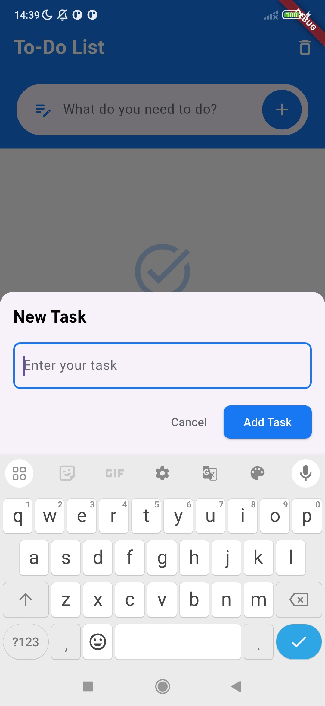
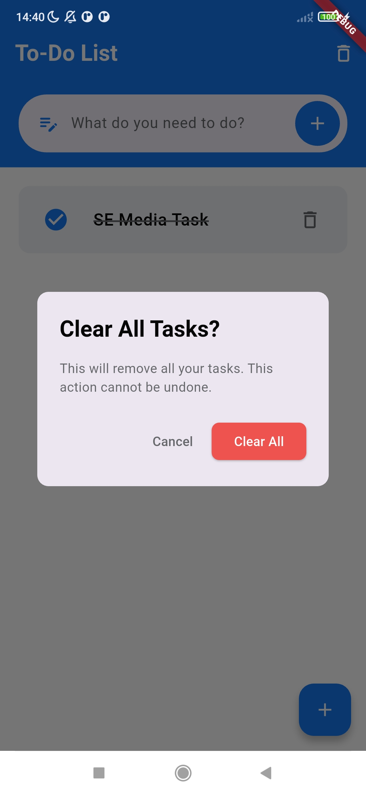
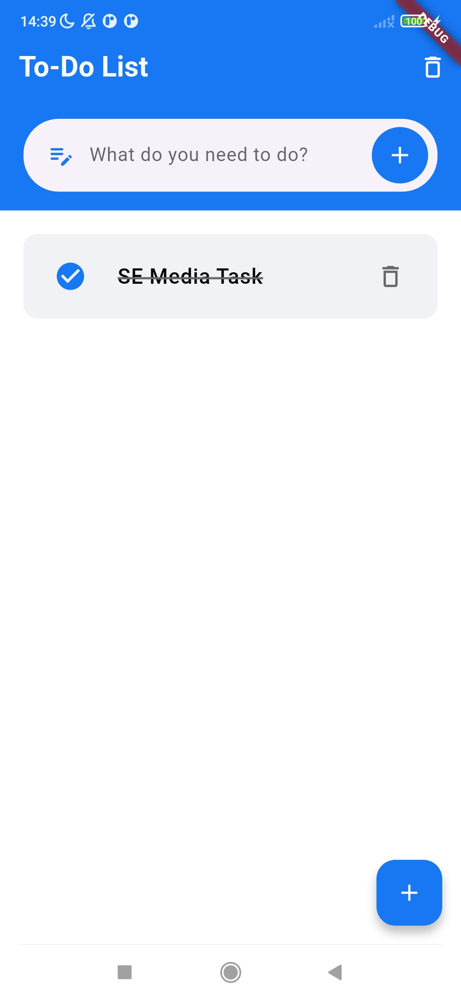

# Task Manager - Flutter Clean Architecture

A beautifully designed task management application built with Flutter using Clean Architecture principles and a Facebook-inspired UI.

## Features

- ✅ Create, complete, and remove tasks with smooth animations
- 🎨 Modern Facebook-inspired UI with intuitive interactions
- 🔄 Swipe to mark tasks as complete or remove them
- 🗑️ Easily clear all completed tasks
- 💾 Persistent local storage using SharedPreferences
- 📱 Beautiful splash screen with fluid animations
- 🏗️ Built with Clean Architecture for maintainability and testability

## Architecture

This project follows Clean Architecture principles to separate concerns and make the codebase maintainable and testable:

```
lib/
│
├── blocs/                         # BLoC state management
│   ├── todo_bloc                  # Manages state using Bloc.
│   ├── todo_events                # Defines user actions (Add, Complete, Remove Task).
│   └── todo_state                 # Defines states (Task List, Updated List).
│
├── models/                        # Contains the task mod
│   ├── task_model                 # Defines a Task model.
│
├── screens/                       # Screen pages
│   ├── todo_screen                # Contains the main UI
│   ├── widget/                    # Reusable UI components
│       ├── animated_task_item     # Contains sliding animation
│
└── main.dart                      # Application entry point
```

## Technologies Used

- **Flutter**: UI framework
- **BLoC Pattern**: State management
- **SharedPreferences**: Local data persistence
- **Equatable**: Value equality

## Installation

1. Make sure you have Flutter installed. For installation instructions, see [Flutter's official documentation](https://flutter.dev/docs/get-started/install).

2. Clone this repository:
   ```bash
   git clone https://github.com/i-saurabha-23/ToDo_App_SE_Media
   ```

3. Navigate to the project directory:
   ```bash
   cd ToDo_App_SE_Media
   ```

4. Get dependencies:
   ```bash
   flutter pub get
   ```

5. Run the app:
   ```bash
   flutter run
   ```

## Screenshots

<table>
  <tr>
    <td></td>
    <td></td>
    <td></td>
  </tr>
  <tr>
    <td></td>
    <td></td>
  </tr>
</table>

## Design

The UI is inspired by Facebook's clean and intuitive design language, featuring:

- Facebook blue primary color (#1877F2)
- Card-based task display with subtle shadows
- Bottom sheet for adding tasks
- Dismissible task cards with swipe gestures
- Smooth transitions and animations

## Acknowledgments

- UI design inspired by Facebook
- Architecture based on Clean Architecture principles
- Flutter team for the amazing framework